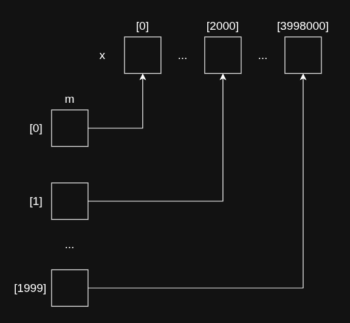

# Soluciones - Práctica de Optimización de Alto Rendimiento

## Ejercicio 1: Niveles de Optimización de GCC

### Descripción de los niveles `-O0`, `-O2` y `-O3`

#### `-O0` (por defecto)

- Reduce el tiempo de compilación
- Depuración produce resultados esperados
- Ninguna optimización activada

---

#### `-O2` (recomendado para producción)

- Casi todas las optimizaciones que no implican trade-off tamaño/velocidad
- Mayor tiempo de compilación y mejor rendimiento
- Incluye todo `-O1` + flags como:
  - `-falign-functions`
  - `-fcse-follow-jumps`
  - `-fgcse`
  - `-finline-functions`
  - `-fstrict-aliasing`
  - `-ftree-loop-vectorize`
  - `-ftree-pre`
  - `-ftree-vrp`
  - Entre otros (~50 flags adicionales)

---

#### `-O3` (máxima optimización)

- Incluye todo `-O2` +:

| Flag | Descripción |
|------|-------------|
| `-fgcse-after-reload` | Optimización GCSE después del reload |
| `-fipa-cp-clone` | Clonado de propagación de constantes IPA |
| `-floop-interchange` | Intercambio de bucles |
| `-floop-unroll-and-jam` | Desenrollado y fusión de bucles |
| `-fpeel-loops` | Pelado de bucles |
| `-fpredictive-commoning` | Commoning predictivo |
| `-fsplit-loops` | División de bucles |
| `-fsplit-paths` | División de caminos |
| `-ftree-loop-distribution` | Distribución de bucles |
| `-ftree-partial-pre` | PRE parcial en árboles |
| `-funswitch-loops` | Descondicionalización de bucles |
| `-fvect-cost-model=dynamic` | Modelo de costo de vectorización dinámico |
| `-fversion-loops-for-strides` | Versionado de bucles para strides |

---

## Ejercicio 2: Técnica "Hacer menos trabajo y más liviano"

### 2.1) Reducción de trabajo

**Archivo:** `2Aex.c`

**Solución:** Se optimiza el bucle para que termine temprano cuando encuentra un elemento que cumple la condición, en lugar de recorrer todo el array innecesariamente.

```c
int solucionOptima(){
    int flag = 0;
    int aMax = n;
    while(!flag && i < aMax){
        flag = complex_func(a[i]) < 55;
        i++;
    }
    printf("¿Elemento encontrado? %d\n", flag);
    return 0;
}
```

**Optimización aplicada:** Early exit (salida temprana) - una vez que se encuentra un elemento que satisface la condición (`complex_func(a[i]) < 55`), el bucle termina, evitando iteraciones innecesarias.

---

### 2.2) Operaciones más livianas

**Archivo:** `2Bex.c`

**Solución:** Se cambia el tipo de dato de `float` a `int` para las variables de iteración y resultado, ya que las operaciones con enteros son más livianas que con punto flotante.

**Solución Inicial:** `5,524s`  
**Solución Nueva:** `3,476s`

```c
int solucionNueva(){
    int i, j, a;

    for(i = 0; i < 1000; i++){
        for(j = 0; j < 1000000; j++){
            a = i + j;
        }
    }
    return a;
}
```

**Optimización aplicada:** Reemplazo de operaciones de punto flotante por operaciones con enteros, que son computacionalmente menos costosas.

---

## Ejercicio 3: Técnica "Reducción del almacenamiento para datos"

### 3.1) Diagrama de la estructura de datos

A continuación se muestra el diagrama que representa punteros y bloques de memoria de la estructura de datos utilizada para la grilla:



**Ventajas de usar un solo bloque de memoria:**

- **Datos alineados:**
  - La CPU accede de forma rápida y eficiente, mejorando el rendimiento.
  - Menos saltos de memoria, aprovechando de mejor forma la caché y reduciendo el tiempo de ejecución.
- **Memoria dinámica:** permite variar el tamaño de la memoria durante la ejecución.

---

## Ejercicio 4: Técnica "Código en Línea"

> ⏳ Pendiente

---

## Ejercicio 5: Técnica "Desenrollado de bucles"

> ⏳ Pendiente

---

## Ejercicio 6: Técnica "Extracción de subexpresiones comunes"

> ⏳ Pendiente

---

## Ejercicio 7: Técnica "Evitar saltos condicionales"

> ⏳ Pendiente

---

## Ejercicio 8: Técnica "Uso eficiente de la caché: localidad espacial y temporal"

> ⏳ Pendiente

---

## Ejercicio 9: Suma horizontal con instrucciones vectoriales

> ⏳ Pendiente

---

## Ejercicio 10: Operaciones vectoriales con funciones intrínsecas

> ⏳ Pendiente

---

## Ejercicio Adicional: Operaciones vectoriales con condicionales

> ⏳ Pendiente
